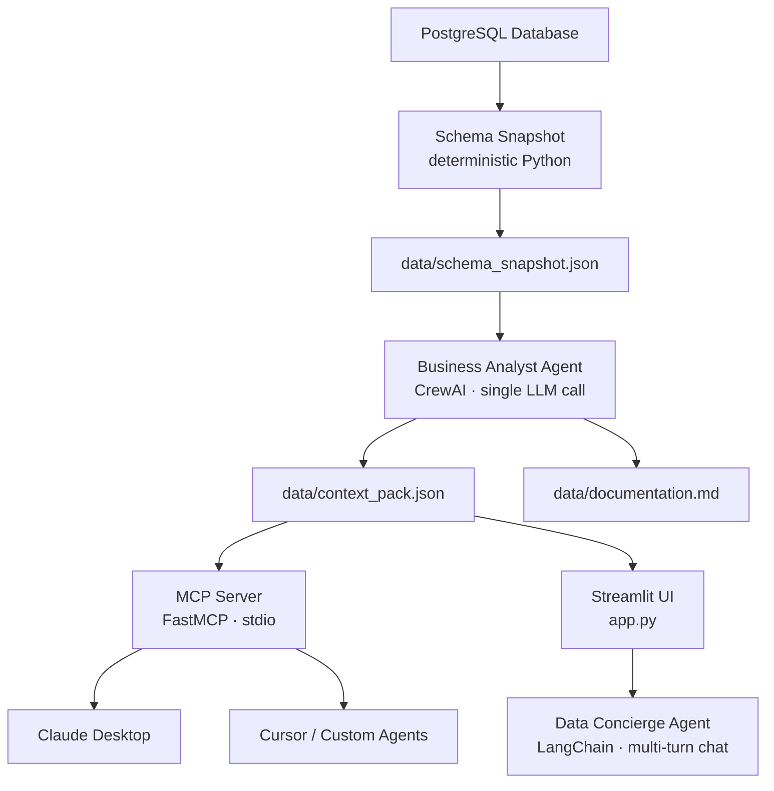

# DataSage 🔍

**Auto-Generated Semantic Layer for AI-Powered SQL**

> "AI writes perfect SQL on demo databases. It fails on yours."

[](LICENSE)
[](https://www.python.org/)
[](https://www.postgresql.org/)
[](https://streamlit.io/)
[](https://modelcontextprotocol.io/)

---

## The Problem

Text-to-SQL AI tools score **85–90%** on clean benchmark databases but drop to **17–21%** on real enterprise schemas. The failure is not model quality — it is missing business context.

Real databases have column names like `ordervault`, `userstamp`, `riskandmarginpivot`, `mktnote`. No LLM can infer what these mean from names alone. Worse, the same column name like `channel` or `status` means completely different things in different tables — and no foreign key exists to signal that.

When an AI agent queries these schemas without context, it produces SQL that is **syntactically valid but semantically wrong**.

---

## What is a Context Pack?

A **Context Pack** is a versioned, portable, machine-readable semantic layer — a JSON file that any AI agent, LLM context window, or text-to-SQL tool can consume.

It contains:

- Business-language **purpose** for every table
- **Per-column meanings** — what the column actually represents, not just its SQL type
- **FK-backed relationships** between tables (no heuristic inference)
- **Ambiguity flags** — columns that share a name across tables but mean completely different things
- **Schema drift detection** — whether the pack is still current against the live database

The Context Pack is not locked inside DataSage. It is a portable artifact the user owns and can inject anywhere.

---

## Architecture



**Core principle:** Deterministic Python for mechanical tasks. LLM only for genuine interpretation.

---

## How It Works

### Step 1 — Schema Snapshot (zero LLM cost)

DataSage connects via a **read-only database role**, reads all tables, column types, primary keys, and declared foreign keys, and samples up to 8 rows per table. PII masking replaces sensitive values before anything reaches an AI model.

### Step 2 — Business Analyst Agent (single LLM call)

A CrewAI-powered Business Analyst agent receives all tables at once — enabling cross-table reasoning in one pass. A deterministic Python function pre-computes cross-table column-name collisions and injects them as a closed checklist into the prompt, preventing the model from missing or inventing ambiguities. Output is validated against a strict Pydantic schema.

### Step 3 — Context Pack + Documentation

The structured output is written to `context_pack.json` and rendered to human-readable Markdown documentation simultaneously. One scan, one LLM call, two artifacts.

### Step 4 — MCP Server

DataSage exposes the Context Pack via three MCP tools over stdio transport. Any MCP-compatible client can call these tools and immediately write accurate SQL on schemas they have never seen before.

### Step 5 — Streamlit UI + Chat

A Streamlit interface handles the full flow: connect → scan → browse documentation → chat. A toggle lets users compare Context Pack mode vs raw schema mode — same question, same model, visibly different SQL quality.

---

## Features

| Feature | Detail |
|---------|--------|
| 🔍 Auto Schema Analysis | Reads tables, columns, PKs, FKs, sample rows automatically |
| 🧠 Business Analyst Agent | Single LLM call across all tables, cross-table collision detection |
| ⚠️ Ambiguity Detection | Pre-computed cross-table column checklist injected into prompt |
| 🛡️ PII Masking | 40+ column-name patterns masked before any LLM call |
| 📄 Dual Output | `context_pack.json` + human-readable Markdown docs |
| 🔄 Drift Detection | Pure structural diff — know when schema changed since last scan |
| 💬 Chat Interface | Data Concierge agent powered by Context Pack context |
| 🔌 MCP Server | Three tools for any MCP-compatible AI client |
| ⬇️ Download | Context Pack downloadable directly from Streamlit sidebar |

---

## Tech Stack

| Layer | Technology |
|-------|------------|
| LLM | Fireworks AI — `accounts/fireworks/models/gpt-oss-120b` |
| Agent framework | CrewAI (Business Analyst), LangChain (Data Concierge) |
| Database | PostgreSQL 18, SQLAlchemy + psycopg2-binary |
| MCP | FastMCP (stdio transport) |
| UI | Streamlit |
| Validation | Pydantic v2 |
| Privacy | Column-name pattern matching, read-only DB role |

---

## Quickstart

### Prerequisites

- Python 3.13+
- PostgreSQL 18
- Git
- A [Fireworks AI](https://fireworks.ai) API key (free tier available)

### 1. Clone the repo

```bash
git clone https://github.com/abdullahgujjar777/DataSage.git
cd DataSage
```

### 2. Create virtual environment

```bash
python -m venv venv

# Windows
venv\Scripts\activate

# macOS/Linux
source venv/bin/activate
```

### 3. Install dependencies

```bash
pip install -r requirements.txt
```

### 4. Configure environment

Create a `.env` file in the repo root:

```env
FIREWORKS_API_KEY=your_fireworks_api_key
LLM_BASE_URL=https://api.fireworks.ai/inference/v1
LLM_MODEL=accounts/fireworks/models/gpt-oss-120b

DB_HOST=localhost
DB_PORT=5432
DB_NAME=your_database
DB_USER=your_user
DB_PASSWORD=your_password
```

### 5. Create read-only database role

```sql
CREATE ROLE datasage_reader WITH LOGIN PASSWORD 'your_password';
GRANT CONNECT ON DATABASE your_database TO datasage_reader;
GRANT USAGE ON SCHEMA public TO datasage_reader;
GRANT SELECT ON ALL TABLES IN SCHEMA public TO datasage_reader;
ALTER DEFAULT PRIVILEGES IN SCHEMA public GRANT SELECT ON TABLES TO datasage_reader;
```

### 6. Run the app

```bash
streamlit run app.py
```

Open `http://localhost:8501`, fill in your connection details, and click **⚡ Scan Database**.

---

## MCP Setup (Claude Desktop)

Install the MCP package:

```bash
pip install "mcp[cli]>=1.0,<2.0"
```

Edit your Claude Desktop config file:

**Windows (standard):**
`%APPDATA%\Claude\claude_desktop_config.json`

**Windows (MSIX/Store):**
`%LOCALAPPDATA%\Packages\Claude_pzs8sxrjxfjjc\LocalCache\Roaming\Claude\claude_desktop_config.json`

**macOS:**
`~/Library/Application Support/Claude/claude_desktop_config.json`

Add this configuration:

```json
{
  "mcpServers": {
    "datasage": {
      "command": "C:\\path\\to\\DataSage\\venv\\Scripts\\python.exe",
      "args": ["C:\\path\\to\\DataSage\\mcp_server.py"]
    }
  }
}
```

Restart Claude Desktop. You will see three DataSage tools available:

| Tool | Description |
|------|-------------|
| `datasage:get_context_pack` | Returns full Context Pack JSON |
| `datasage:query_documentation` | Returns single table entry by name |
| `datasage:check_drift` | Structural diff against live database |

---

## MCP Tools Reference

### `get_context_pack()`

Returns the full Context Pack as JSON. Call this first before writing any SQL or answering questions about the schema.

### `query_documentation(table_name: str)`

Returns the Context Pack entry for a single named table. More token-efficient than `get_context_pack()` for targeted lookups.

### `check_drift()`

Compares the current database structure against the snapshot captured when the Context Pack was last generated. Reports added/removed tables and column-level changes. No LLM involved — pure structural diff.

---

## Demo Database

Tested on the **BIRD-Interact Lite `crypto` database** — a 10-table cryptocurrency exchange schema with intentionally obfuscated column names:

| Table | Purpose |
|-------|---------|
| `users` | User accounts with `userstamp`, `acctscope` |
| `orders` | Trade orders with `ordervault`, `mktnote`, `dealedge` |
| `orderexecutions` | Fill details with `fillcount`, `remaincount`, `exectune` |
| `accountbalances` | Wallet balances with `walletsum`, `availsum`, `unrealline` |
| `riskandmargin` | Risk profiles stored as JSONB |
| `fees` | Fee and rebate records per order |
| `marketdata` | Order-book snapshots stored as JSONB |
| `marketstats` | Daily market statistics |
| `analyticsindicators` | Sentiment indicators stored as JSONB |
| `systemmonitoring` | Platform performance metrics |

Complexity score: **89.0** — Tier 1 (full context injection).

---

## Context Pack vs Raw Schema — Side by Side

**Question:** *Display the risk profile ID, related order, account balance, margin requirement and margin usage*

**Without Context Pack** (raw column names only):
```sql
-- Wrong: uses unrealline as margin_usage (it's P&L, not margin)
-- Wrong: joins directly on userlink without following the FK chain
SELECT r.risk_margin_profile AS risk_profile_id,
       o.orderspivot AS related_order_id,
       a.accountbalancesnode AS account_balance_id,
       a.margsum AS margin_requirement,
       a.unrealline AS margin_usage  -- ❌ wrong column
FROM riskandmargin r
JOIN orders o ON r.ordervault = o.recordvault
JOIN accountbalances a ON a.usertag = o.userlink  -- ❌ skips users table
```

**With Context Pack:**
```sql
-- Correct: follows full FK chain riskandmargin → orders → users → accountbalances
-- Correct: uses availsum as margin balance per documented meaning
SELECT r.riskandmarginpivot AS risk_profile_id,
       r.ordervault AS order_id,
       a.accountbalancesnode AS account_balance_id,
       a.margsum AS margin_requirement,
       a.availsum AS margin_balance,
       (a.margsum / NULLIF(a.availsum, 0)) AS margin_usage  -- ✅ correct
FROM riskandmargin r
JOIN orders o ON r.ordervault = o.recordvault
JOIN users u ON o.userlink = u.userstamp        -- ✅ correct join
JOIN accountbalances a ON a.usertag = u.userstamp
```

---

## Project Structure

```
DataSage/
├── app.py                    # Streamlit UI
├── mcp_server.py             # FastMCP server — 3 tools
├── schema_snapshot.py        # Deterministic schema collection
├── drift_detector.py         # Schema drift detection
├── markdown_renderer.py      # Markdown rendering — zero LLM
├── pii_masker.py             # PII column masking
├── requirements.txt
├── .env                      # Not committed
├── agents/
│   ├── business_analyst.py   # CrewAI agent — Context Pack generation
│   └── data_concierge.py     # LangChain agent — chat + Text-to-SQL
├── connectors/
│   └── postgres.py           # SQLAlchemy engine, schema + sample collection
├── models/
│   ├── schema_models.py      # ColumnInfo, TableSchema, SampleRow
│   └── analysis_models.py    # TableAnalysis, SchemaAnalysis, ContextPack
└── data/
    ├── schema_snapshot.json  # Raw schema + samples
    ├── schema_analysis.json  # Full analysis output
    ├── context_pack.json     # Alias — same content, user-facing name
    └── documentation.md      # Human-readable Markdown render
```

---

## Privacy & Safety

- **Read-only database role** — `datasage_reader` cannot modify data
- **8 row sample limit** — never full table scans
- **PII masking** — 40+ column-name patterns (email, name, phone, SSN, etc.) replaced with `[MASKED]` before any LLM call
- **UI toggle** — PII masking on by default; masked columns shown in sidebar
- **Public deploy** — only reader credentials in Streamlit secrets

---

## Known Limitations

- **JSONB sub-field extraction** — Context Pack documents JSONB section names (e.g. `leverage`, `position`) but not internal keys (e.g. `levscale`, `possum`). Both modes fail equally on deep JSONB queries. Documented, not a bug.
- **SQL blocklist** — keyword-based, not AST-based. Sufficient for hackathon; upgrade path is `sqlparse` or `pglast`.
- **PII detection** — column-name pattern matching only; does not inspect actual values.
- **Single schema** — reads `public` schema only. Multi-schema support is the next extension point.
- **PostgreSQL only** — MySQL, BigQuery, Snowflake support planned.

---

## Roadmap

- Multi-database support — MySQL, BigQuery, Snowflake, Redshift
- Incremental updates — re-scan only changed tables on drift
- Team annotations — override auto-generated meanings
- CI/CD integration — drift detection as a pipeline check
- Context Pack registry — version and publish packs
- Fine-tuning dataset — Context Packs as structured training data

---

## License

MIT — see [LICENSE](LICENSE)

---

## Built for

**AMD Developer Hackathon: ACT II** on [lablab.ai](https://lablab.ai)

LLM compute: [Fireworks AI](https://fireworks.ai) — `gpt-oss-120b` on AMD MI300X

---

> The Context Pack travels with the schema, not with the tool. Any agent that can read JSON can use it.
